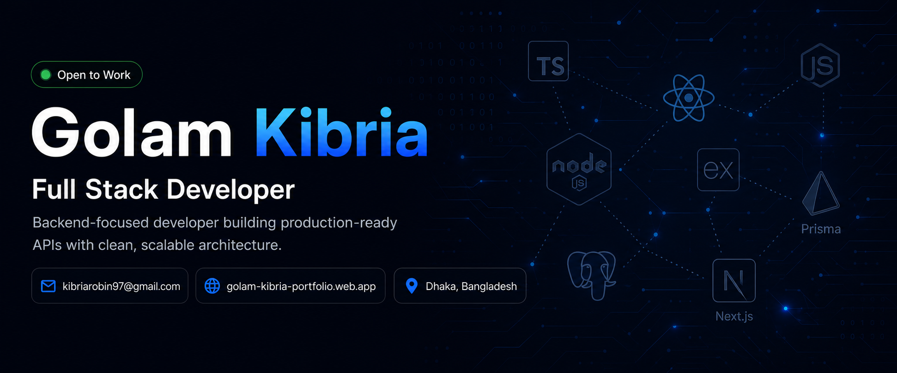

<h1 align="center">Hi 👋, I'm Golam Kibria</h1>
<h4 align="center">Full Stack Developer</h4>

### 👋 About Me

I design and build robust backend systems with <b>Node.js, Express, TypeScript, Prisma & PostgreSQL</b> — 
from auth and payments to transaction-safe order flows. Currently deepening my skills in 
<b>Next.js, Docker/NGINX, and AI/LLM integration</b> through a structured full-stack engineering program.

**🔭 What I'm working on right now:**
- Exploring **Next.js (SSR)** — App Router, Server Components, and Server Actions
- Building backend APIs with **Prisma ORM** and **PostgreSQL**
- Advancing through the **Next Level Web Development** program (Programming Hero) — up next: **Docker & NGINX** and **AI/LLM & RAG integration**

---

### 🛠️ Tech Stack

**Languages & Runtime**

**Backend & Databases**

**Frontend**

**Tools & Deployment**

---

### 🚀 Featured Backend Projects

**[GearUp](https://github.com/kibriarobin) — Sports Equipment Rental Platform API**
Node.js · Express · TypeScript · Prisma · PostgreSQL
- JWT authentication with role-based access control
- SSLCommerz payment gateway integration
- Atomic stock management using Prisma transactions
- Status-transition enforcement system for rental orders
- Global error handler with keyword-based HTTP status detection
- Deployed on Vercel

**[Prisma Press](https://github.com/kibriarobin) — Blog Platform API**
Node.js · Express · TypeScript · Prisma · NeonDB · Stripe
- Auth, Post, and Comment modules with role-based permissions
- Stripe subscription & webhook integration
- Reusable `sendResponse` + `catchAsync` architecture

**[DevPulse](https://github.com/kibriarobin) — Bug & Feature Tracker API**
Express · TypeScript · PostgreSQL (NeonDB) · JWT · bcryptjs
- Modular project architecture (route/controller/service/interface)
- Resolved TypeScript ESM configuration issues, bundled with `tsup`
- Deployed on Render

---

### 🤝 Open to Collaborate On
Scalable backend APIs, full-stack MERN/PERN applications, and full-stack developer roles (remote, hybrid, or onsite)

### 📫 Reach Me

---

